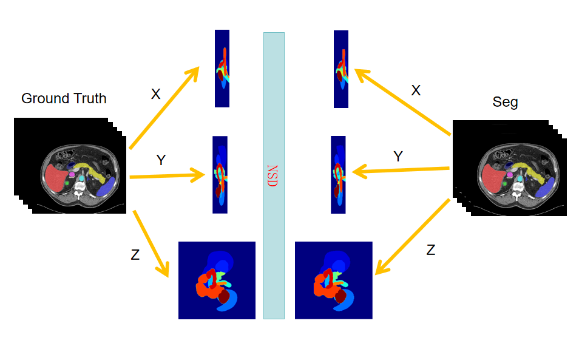
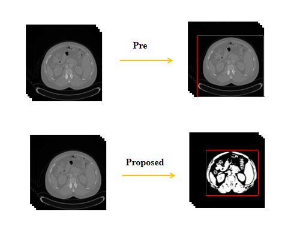
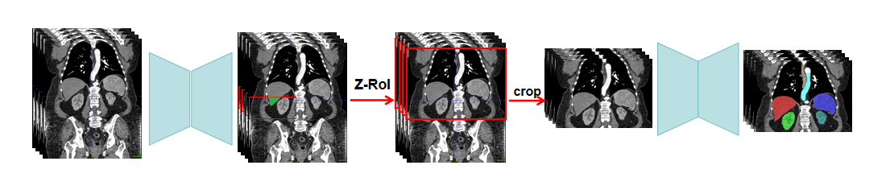

#  **Performance Booster** for MICCAI FLARE2024 Task 2


## Introduction

### Overview of our work.








## Environments and Requirements

The basic language for our work is [python](https://www.python.org/), and the baseline
is [nnU-Net](https://github.com/MIC-DKFZ/nnUNet/tree/nnunetv1) and [the FLARE2022 champion scheme](https://github.com/Ziyan-Huang/FLARE22) So, you can install the nnunet frame with
the [GitHub Repository](https://github.com/MIC-DKFZ/nnUNet/tree/nnunetv1), or use the following comments:

```
pip install torch torchvision torchaudio
pip install -e .
```

## Prepocessing

We're not sure if you're going to have a problem running this code here, so we recommend that you use the code from [the FLARE2022 champion scheme](https://github.com/Ziyan-Huang/FLARE22) for data preprocessing.

```
nnUNet_plan_and_preprocess -t Task_id -pl3d ExperimentPlanner3D_FLARE22Small -pl2d None
```

### Train the model 

```
nnUNet_train 3d_fullres nnUNetTrainerV2_FLARE_Small Task_id Fold_id -p nnUNetPlansFLARE22Small
```

### Do Efficient Inference

```
nnUNet_predict -i INPUT_FOLDER  -o OUTPUT_FOLDER  -t Task_id  -p nnUNetPlansFLARE22Small   -m 3d_fullres \
 -tr nnUNetTrainerV2_FLARE_Small  -f Fold_id  --mode fastest --disable_tta
```


